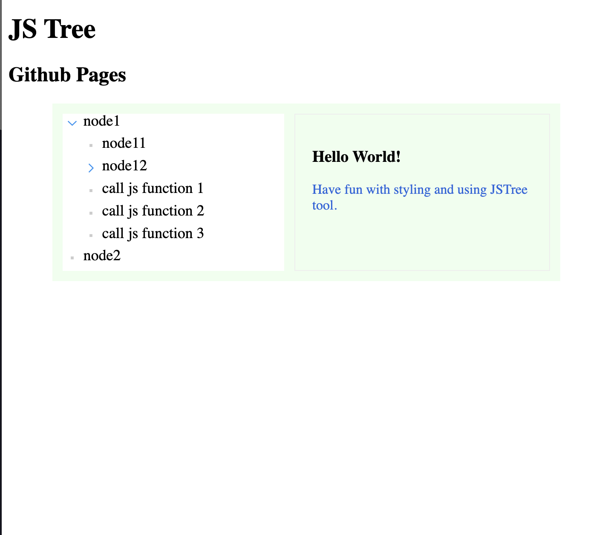

# js tree

## url
https://jaisocx-tools.github.io/jstree/


## screenshot



## about
this sample web project is a sample of css styling of a nested json objects of same format, in a tree mode.

the html markup is produced by JSTree javascript class, used here in this project with javascript source code and no 3rd party dependencies.

## future improvements
easy to implement themes switching.


## how to use

### how to set json data for the table
in the file www/index.html, on line 60,
there is the url to json file, containing table rows data in json format.
"/jstools/www/data/table.json"

You can set Your own url of any published in web json data of some table records.

### how to set columns in the table
in the file www/js/JSTable.js there is the javascript class JSTable,

feel free to adjust number of columns and source json properties values as columns text.

Columns widths:
```
index.html, line 18:
      const tableHeader = {
        "id": {
          "title": "id",
          "type": "number",
          "width": "50px",
          "align": "right"
        },
        "image_src": {
          "title": "Image",
          "type": "image",
          ...
          ...
          ...

```

for more informations, how to specify columns widths, feel free to read css3 documentation 
about "grid layout". 


### styling
in file www/css/variables.css, there are css variables specified, 
those enable fast applying some basic look and feel customization. 


### urls, images sources, paths
in this project, the urls are relative, without domain name, 
however here was supposed, that the www folder is published as /jstree/www/ folder for the domain.

so, the {github project root}/www/index.html file is published like http://{domain}/jstree/www/index.html 

please, adjust urls in index.html and .css files to be accessible when You publish at Your domain.

