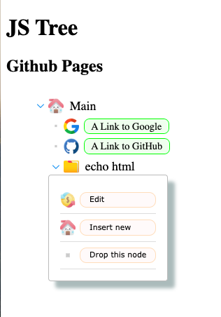

# js tree

## url
https://jaisocx-tools.github.io/jstree/

## screenshot

## about
this sample web project is a sample of css styling of a nested json objects of same format, in a tree mode.

the html markup is produced by JSTree javascript class, used here in this project with javascript source code and no 3rd party dependencies.

## future improvements
easy to implement themes choice.

## how to use

### styling
in file www/css/variables.css, there are css variables specified, 
those enable fast applying some basic look and feel customization. 

### urls, images sources, paths
in this project, the urls are relative, without domain name, 
however here was supposed, that the www folder is published as /jstree/www/ folder for the domain.

so, the {github project root}/www/index.html file is published like http://{domain}/jstree/www/index.html 

please, adjust urls in index.html and .css files to be accessible when You publish at Your domain.

